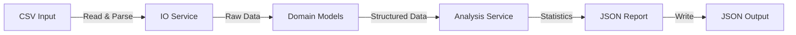

# Architecture Documentation - Student Grade Analytics Tool

## System Overview

The Student Grade Analytics Tool is a CLI application designed to ingest student grade data, perform statistical analysis, and output structured reports. It isolates data representation, processing logic, and input/output operations.

## Architectural Layers

| Layer            | Component   | Responsibility                                                                                    |
| ---------------- | ----------- | ------------------------------------------------------------------------------------------------- |
| **Presentation** | `main.py`   | CLI entry point, argument parsing, orchestration of services.                                     |
| **Domain**       | `models/`   | Type-safe data structures (`dataclass`, `NamedTuple`) representing Students, Courses, and Grades. |
| **Service**      | `services/` | Business logic for file I/O operations and statistical calculations.                              |

## Data Flow

## Component Details

### 1. Models

- **Student**: Dataclass holding personal info and a list of courses.
- **Course**: NamedTuple or Dataclass for course details and grade.
- **Grade**: Type alias or Enum for grade representation.

### 2. IO Service

- Uses `contextlib` for resource management.
- Handles CSV reading (`csv.DictReader`) and JSON writing.
- Manages file paths using `pathlib`.

### 3. Analysis Service

- **Distribution**: Uses `Counter` to tally grades.
- **Grouping**: Uses `defaultdict` to group students by major.
- **Ranking**: Sorts and calculates percentiles.
- **Trends**: Uses `deque` for rolling averages (if applicable).

## Design Decisions

- **Poetry**: Used for deterministic dependency management.
- **Type Hints**: Extensive use of `typing` module for code clarity and static analysis.
- **Advanced Collections**: Chosen over standard lists/dicts for performance and expressiveness (e.g., `Counter` vs manual counting).
