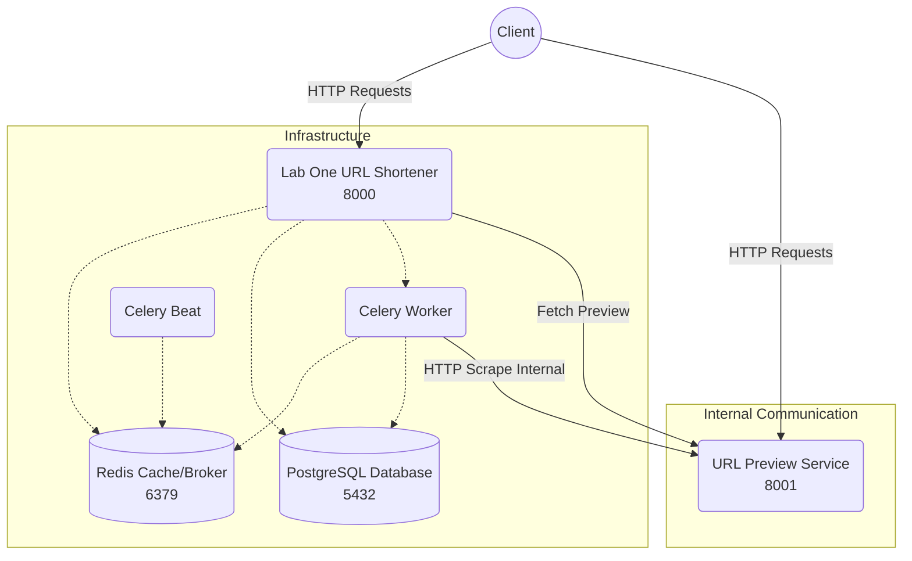

# URL Shortener Microservices

This project is a complete URL shortener backend built with Django, Django REST Framework, Celery, Redis, and PostgreSQL. It adopts a microservice architecture, separating the core URL shortening logic from a URL preview capability.

The project exposes RESTful endpoints with full Swagger documentation and employs asynchronous background processing to handle link analytics and URL scraping safely and efficiently.

## Architecture

The project is split into two primary backend services along with necessary infrastructure components:



### Services Overview:

- **Web App (`lab_one_url_shortener`)**: Serves core shortening endpoints, auth, and analytics via port `8000`.
- **URL Preview (`url_preview`)**: An internal/external microservice dedicated to scraping HTML metadata (title, description, favicon) via port `8001`.
- **Redis**: Serves as the message broker for Celery and high-performance caching for top clicked URLs and user metrics.
- **Postgres**: The primary relational data store.
- **Celery Worker & Celery Beat**: Processes background jobs as well as scheduled tasks seamlessly without blocking the main web threads.

---

## Prerequisites

- Python 3.9+
- Docker and Docker Compose (For containerized deployment)

---

## How to Run the Project Locally

### 1. Creating and Activating a Virtual Environment

It's highly recommended to utilize a virtual environment for local package management and running tests.

**Windows:**

```bash
# Create the virtual environment
python -m venv venv

# Activate the virtual environment
venv\Scripts\activate

# Install dependencies for both microservices
cd lab_one_url_shortener
pip install -r requirements.txt
cd ../url_preview
pip install -r requirements.txt
cd ..
```

**macOS / Linux:**

```bash
# Create the virtual environment
python3 -m venv venv

# Activate the virtual environment
source venv/bin/activate
```

### 2. Running With Docker Compose

The easiest way to spin up the entire architecture (Django, Postgres, Redis, Celery, Preview Service) is to use Docker Compose. Environment variables are automatically loaded from `.env` files.

Make sure your Docker daemon is running inside the project directory, execute:

```bash
docker-compose --project-directory ./lab_one_url_shortener -f ./lab_one_url_shortener/docker-compose.yml up --build -d
```

_(Alternatively, you can just cd into `lab_one_url_shortener` and run `docker-compose up --build` if you prefer)._

To view active logs:

```bash
docker-compose --project-directory ./lab_one_url_shortener -f ./lab_one_url_shortener/docker-compose.yml logs -f
```

---

## Running the Tests (Pytest)

To run tests against the microservices, ensure you have activated your virtual environment with `pytest` installed.

1.  Activate your virtual environment:
    ```bash
    venv\Scripts\activate  # Windows
    ```
2.  Run pytest at the root or specific applications:
    ```bash # Run all tests in the main backend service
    cd lab_one_url_shortener
    pytest

        # Run tests for preview service
        cd ../url_preview
        pytest
        ```

    _(Make sure to apply database migrations or run inside an active docker test container if integration tests require db connections)_

---

## List of Endpoints

### 1. Main URL Shortener App (Runs on `localhost:8000`)

_(Interactive Swagger Docs available at `http://localhost:8000/swagger/`)_

**Authentication & User Management**

- `POST /api/v1/auth/register/` - Register a new user account.
- `POST /api/v1/auth/login/` - Obtain JWT access & refresh tokens.
- `POST /api/v1/auth/refresh/` - Refresh an expired access token.

**URL Operations**

- `POST /api/v1/urls/shorten/` - Shorten a newly provided long URL.
- `GET /api/v1/urls/` - Retrieve paginated list of created shortened URLs.
- `GET /api/v1/urls/<str:identifier>/` - Retrieve details and stats of a specific URL.
- `GET /api/v1/urls/top-clicked/` - Retrieve the top most-clicked global URLs.
- `GET /api/v1/urls/user-clicks/` - Retrieve URL click metrics scoped to the authenticated user.

**Analytics & Core**

- `GET /api/v1/analytics/<identifier>/` - Detailed analytics (time-series, platforms, etc.) for a specific short URL.
- `GET /api/v1/<identifier>/` (or Base Direct) - Given a valid short code, redirects the user to the original Long URL (and tracks clicks asynchronously).
- `GET /api/v1/health/` - Check server health and status.

### 2. URL Preview Microservice (Runs on `localhost:8001`)

_(Interactive Swagger Docs available at `http://localhost:8001/swagger/`)_

- `GET /api/preview/?url=<your_url>` - Fetches the HTML properties of the target URL to return its `title`, `description`, and `favicon` safely.
